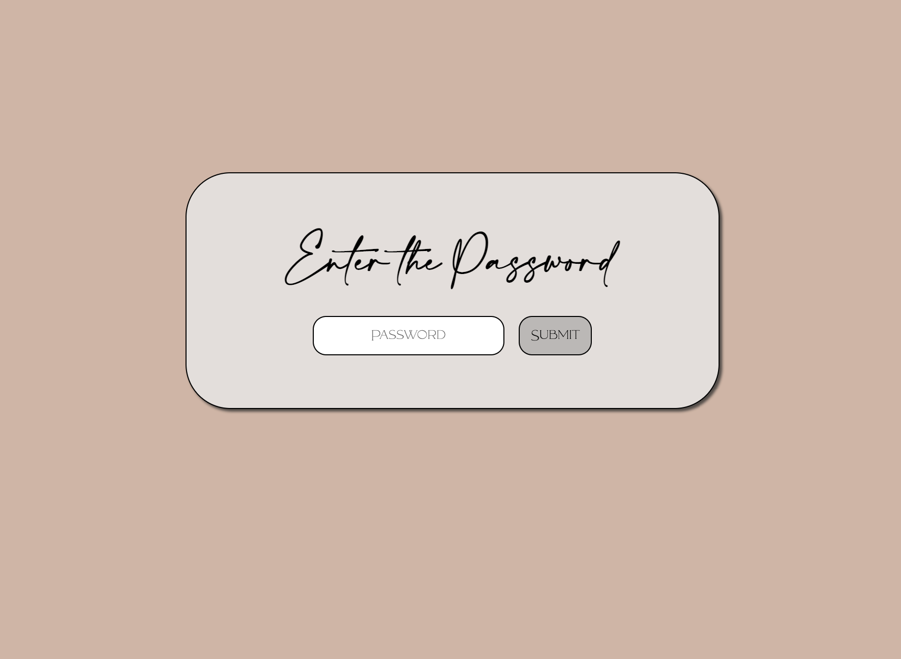
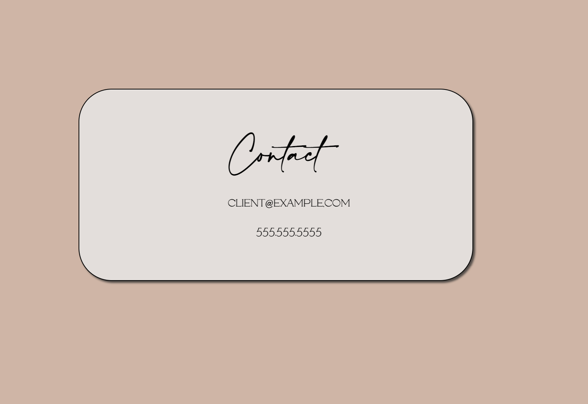

# Authorization Form
* [CodeCademy Learn React](https://www.codecademy.com/courses/react-101/projects/authorization-form)

A client just called to say that they love their new website! There’s only one problem: they don’t like how their contact page displays their personal information for all to see.

They’ve asked to hide their website’s contact page behind a password form. In this project, React component is used to set up a simple authorization layer.

Password: swordfish

## Technolgoies Used
* HTML 
* CSS
* JavaScript
* React

## Working App

## Getting Started

